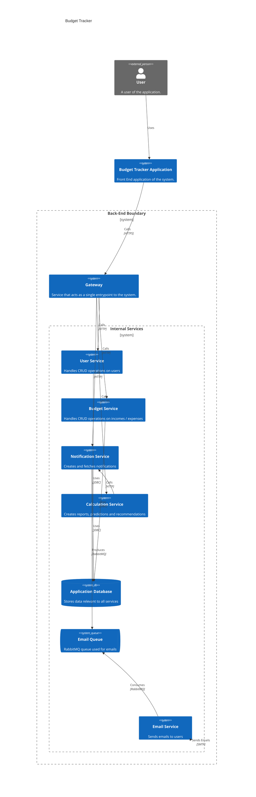
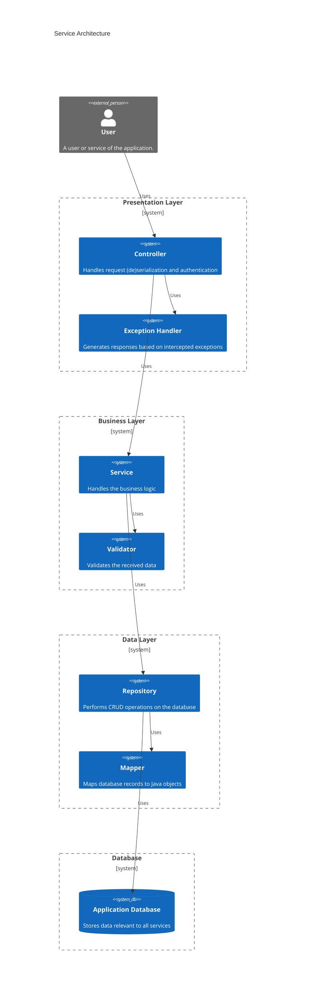

# Architecture

## System Architecture

```mermaid
    C4Context
    title Budget Tracker

    System(empty1, "")
    Person_Ext(user, "User", "A user of the application.")
    System(empty2, "")
    System(empty3, "")

    System(empty4, "")
    System(frontEnd, "Budget Tracker Application", "Front End application of the system.")

    Boundary(backEndBoundary, "Back-End Boundary") {
        System(empty5, "")
        System(gateway, "Gateway", "Service that acts as a single entrypoint to the system.")

        Boundary(internalServicesBoundary, "Internal Services") {
            System(userService, "User Service", "Handles CRUD operations on users")
            System(budgetService, "Budget Service", "Handles CRUD operations on incomes / expenses")
            System(notificationService, "Notification Service", "Creates and fetches notifications")
            System(calculationService, "Calculation Service", "Creates reports, predictions and recommendations")
            System(empty6, "")
            SystemDb(database, "Application Database", "Stores data relevant to all services")
            SystemQueue(emailQueue, "Email Queue", "RabbitMQ queue used for emails")
            System(empty7, "")
            System(empty8, "")
            System(empty9, "")
            System(emailService, "Email Service", "Sends emails to users")

        }
    }

    Rel(user, frontEnd, "Uses")
    Rel_D(frontEnd, gateway, "Calls", "HTTPS")
    Rel_D(gateway, userService, "Calls", "HTTP")
    Rel_D(gateway, budgetService, "Calls", "HTTP")
    Rel_D(gateway, notificationService, "Calls", "HTTP")
    Rel_D(gateway, calculationService, "Calls", "HTTP")
    
    Rel_D(calculationService, notificationService, "Calls", "HTTP")
    
    Rel_D(userService, database, "Uses", "JDBC")
    Rel_D(budgetService, database, "Uses", "JDBC")
    Rel_D(notificationService, database, "Uses", "JDBC")
    Rel_D(notificationService, emailQueue, "Produces", "RabbitMQ")
    Rel_D(emailService, emailQueue, "Consumes", "RabbitMQ")
    Rel_D(emailService, emailService, "Sends Emails", "SMTP")

    UpdateLayoutConfig($c4ShapeInRow="4", $c4BoundaryInRow="1")

    UpdateElementStyle(empty1, $fontColor="rgba(0,0,0,0)", $bgColor="rgba(0,0,0,0)", $borderColor="rgba(0,0,0,0)")
    UpdateElementStyle(empty2, $fontColor="rgba(0,0,0,0)", $bgColor="rgba(0,0,0,0)", $borderColor="rgba(0,0,0,0)")
    UpdateElementStyle(empty3, $fontColor="rgba(0,0,0,0)", $bgColor="rgba(0,0,0,0)", $borderColor="rgba(0,0,0,0)")
    UpdateElementStyle(empty4, $fontColor="rgba(0,0,0,0)", $bgColor="rgba(0,0,0,0)", $borderColor="rgba(0,0,0,0)")
    UpdateElementStyle(empty5, $fontColor="rgba(0,0,0,0)", $bgColor="rgba(0,0,0,0)", $borderColor="rgba(0,0,0,0)")
    UpdateElementStyle(empty6, $fontColor="rgba(0,0,0,0)", $bgColor="rgba(0,0,0,0)", $borderColor="rgba(0,0,0,0)")
    UpdateElementStyle(empty7, $fontColor="rgba(0,0,0,0)", $bgColor="rgba(0,0,0,0)", $borderColor="rgba(0,0,0,0)")
    UpdateElementStyle(empty8, $fontColor="rgba(0,0,0,0)", $bgColor="rgba(0,0,0,0)", $borderColor="rgba(0,0,0,0)")
    UpdateElementStyle(empty9, $fontColor="rgba(0,0,0,0)", $bgColor="rgba(0,0,0,0)", $borderColor="rgba(0,0,0,0)")
```

## Service Architecture

```mermaid
    C4Context
    title Service Architecture

    Person_Ext(user, "User", "A user or service of the application.")

    Boundary(presentationBoundary, "Presentation Layer") {
        System(controller, "Controller", "Handles request (de)serialization and authentication")
        System(errorHandler, "Exception Handler", "Generates responses based on intercepted exceptions")
    }

    Boundary(businessBoundary, "Business Layer") {
        System(service, "Service", "Handles the business logic")
        System(validator, "Validator", "Validates the received data")
    }
    
    Boundary(dataBoundary, "Data Layer") {
        System(repository, "Repository", "Performs CRUD operations on the database")
        System(mapper, "Mapper", "Maps database records to Java objects")
    }


    Boundary(databaseBoundary, "Database") {
        SystemDb(database, "Application Database", "Stores data relevant to all services")
    }

    Rel(user, controller, "Uses")
    Rel(controller, errorHandler, "Uses")
    Rel(controller, service, "Uses")
    Rel(service, validator, "Uses")
    Rel(service, repository, "Uses")
    Rel(repository, mapper, "Uses")
    Rel(repository, database, "Uses")

    UpdateLayoutConfig($c4ShapeInRow="2", $c4BoundaryInRow="1")
```
